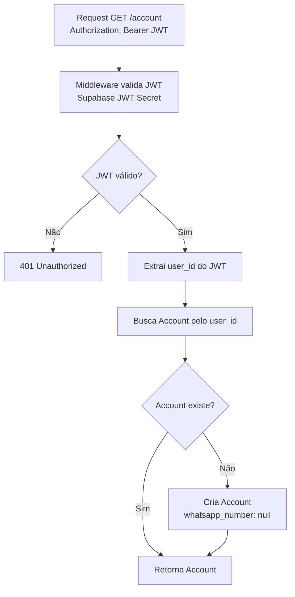
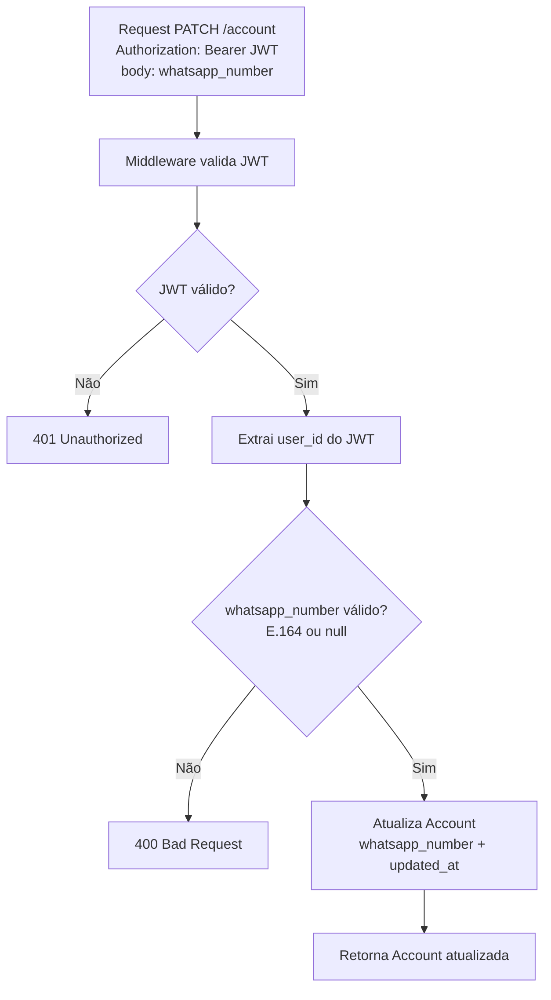

# Workflow — Account

## GetAccount

Retorna as preferências da account autenticada. Cria a account se ainda não existir (não aplicável quando trigger está ativo — mantido como fallback).



---

## UpdateAccount

Influenciador atualiza o número de WhatsApp.



---

## ResolveRecipient (interno — contexto Notification)

Quando Notification precisa do número de WhatsApp para criar uma `Notification`, carrega a Account.

```mermaid
flowchart TD
    A[Evento recebido\nincident_opened | incident_resolved] --> B[Carrega Account]
    B --> C{WhatsAppNumber disponível?}
    C -- Não --> D[Ignorar — RN-AC004\nsem destinatário, sem Notification]
    C -- Sim --> E[Cria Notification com recipient\n= Account.WhatsAppNumber]
```

---

## Regras aplicadas nos workflows

| Regra | Onde se aplica |
|---|---|
| JWT obrigatório em todo request | GetAccount, UpdateAccount |
| Account criada no trigger `on_auth_user_created` | Criação automática |
| Fallback lazy: cria se não existir no `GET /account` | GetAccount |
| `WhatsAppNumber` em E.164 ou null | UpdateAccount |
| Account sem número → notificações ignoradas | ResolveRecipient |
| `updated_at` atualizado a cada `PATCH` | UpdateAccount |
