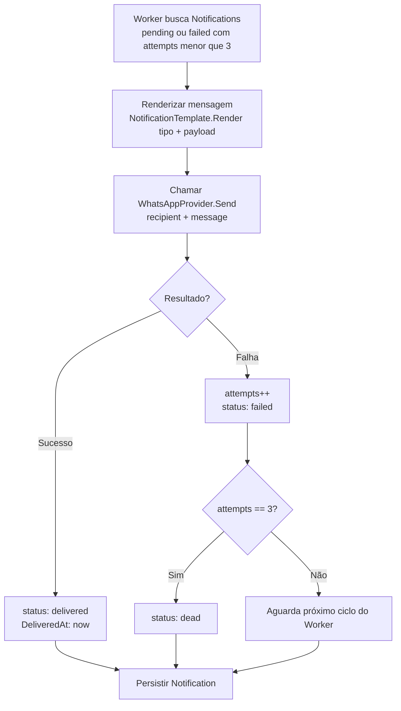

# Workflow — Notification

## EnqueueNotification

Disparado quando Observability emite `incident_opened` ou `incident_resolved`.

```mermaid
flowchart TD
    A[Evento recebido\nincident_opened | incident_resolved] --> B[Resolver WhatsAppNumber\ndo perfil do influenciador]
    B --> C{Número disponível?}
    C -- Não --> D[Ignorar — sem destinatário\nnão há Notification]
    C -- Sim --> E[Criar Notification\nstatus: pending\nattempts: 0]
    E --> F[Persistir Notification]
    F --> G[Fim — Worker processa assincronamente]
```

---

## DeliverNotification

Worker processa `Notification` com status `pending` ou `failed` (attempts < 3).



---

## Regras aplicadas nos workflows

| Regra | Onde se aplica |
|---|---|
| Sem número → sem Notification | EnqueueNotification |
| `pending` nasce com `attempts: 0` | EnqueueNotification |
| Template fixo por tipo | DeliverNotification |
| Máximo 3 tentativas | DeliverNotification |
| `delivered` e `dead` são finais | DeliverNotification |
| Worker não processa `delivered` nem `dead` | DeliverNotification |
