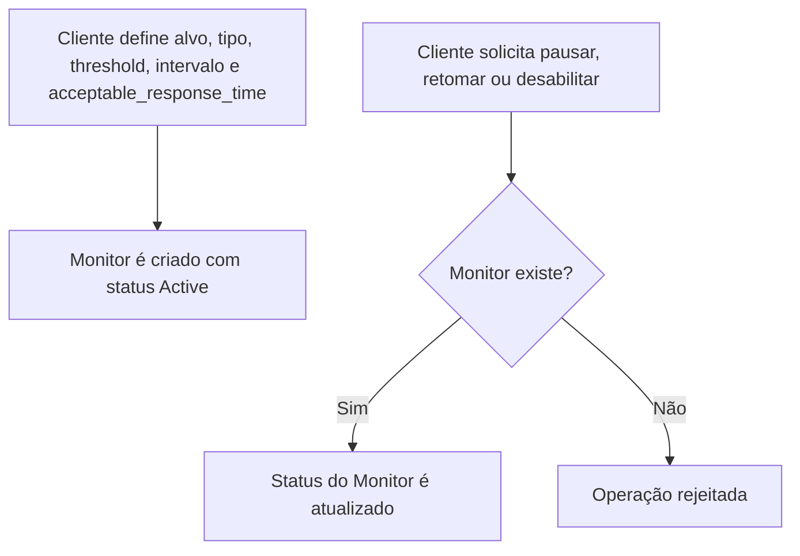
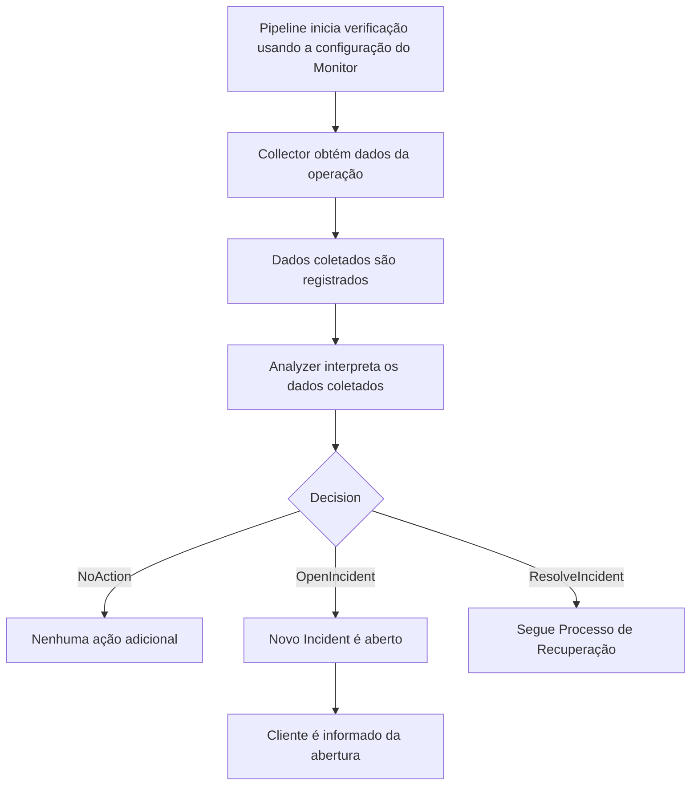
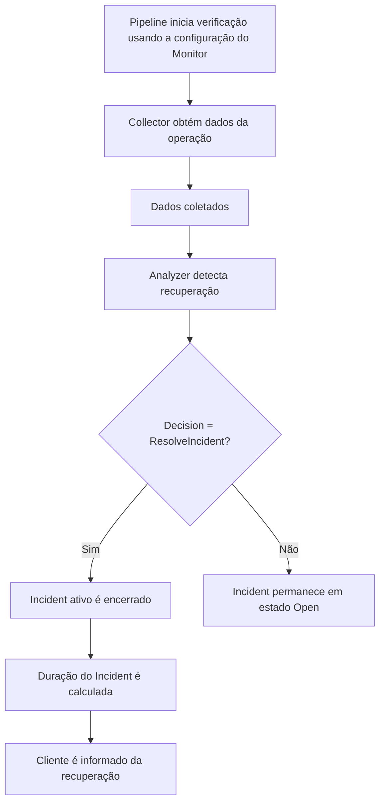
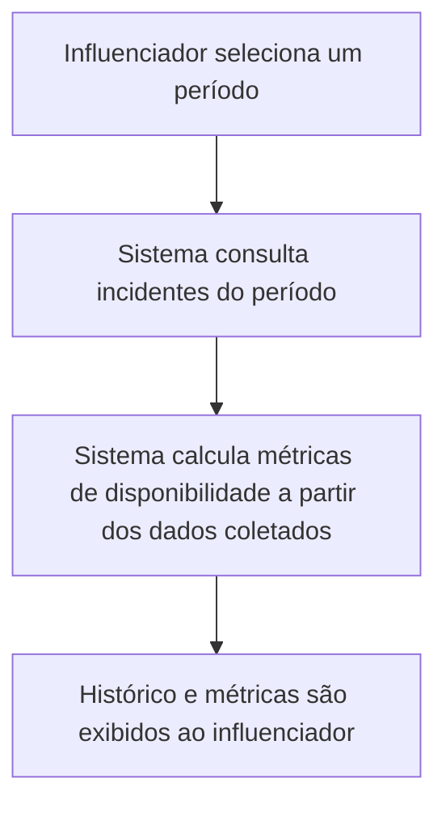
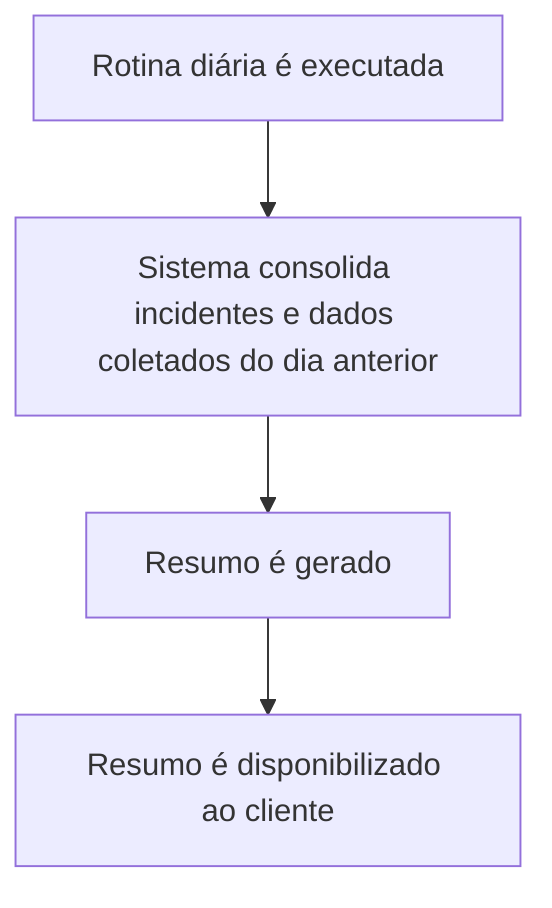

# Workflow — Observability

## Objetivo

Descrever **como o contexto Observability se comporta ao longo do tempo** — etapas, decisões e
fluxo de dados — a partir dos conceitos centrais já fechados em `domain-discovery.md` (`Monitor`,
`Incident`) e dos mecanismos internos ali identificados (`Collector`, `Analyzer`, tratados como
papéis técnicos, não conceitos de domínio). Tudo que é comportamento, ordem de execução ou
decisão temporal pertence a este documento — `domain-discovery.md` descreve apenas os conceitos.

## Fluxo Funcional Orientado a Dados

Os processos abaixo seguem o mesmo eixo funcional:

```
Monitor
   ↓
Collector            (mecanismo interno — obtém dados da operação)
   ↓
Dados coletados      (samples / resultados de verificação / métricas — dado operacional)
   ↓
Analyzer             (mecanismo interno — interpreta os dados coletados)
   ↓
Decision             (OpenIncident / ResolveIncident / NoAction)
   ↓
Incident
```

`Collector` e `Analyzer` continuam sendo mecanismos internos — não pertencem à linguagem ubíqua —
mas participam ativamente do processamento e por isso aparecem nos fluxos abaixo.

## Processo: Gestão de Monitor

**Descrição**: cliente cria e mantém suas configurações de verificação — criar um `Monitor` e
transicionar seu status operacional (Active, Paused, Disabled). É o processo que dá origem às
configurações que os demais processos consomem; sem ele, não há o que verificar.

**Pré-condições**: nenhuma para criação; para transições de status, o `Monitor` precisa existir.

**Pós-condições**: `Monitor` criado sempre nasce com status Active; transições de status
respeitam o vínculo de no-máximo-um-Incident-Open mantido pelo sistema — mudar o status de um
`Monitor` não cria, encerra nem altera `Incident` (RN-037, RN-028).

**Side effects**: nenhum.



## Processo: Verificação de Monitor

**Descrição**: execução periódica de uma verificação para um `Monitor` — o pipeline coleta dados
da operação a partir da configuração do Monitor e os interpreta — podendo levar à abertura de um
`Incident`, ou confirmar que tudo segue normal.

**Pré-condições**: `Monitor` está com status Active.

**Pós-condições**: dados coletados são registrados; `Incident` é aberto quando o threshold de
ocorrências consecutivas é atingido (RN-001, RN-002, RN-027, RN-028). Para Monitor do tipo
Checkout, o Analyzer avalia latência contra `AcceptableResponseTime` (Lentidão — RN-025); para
Uptime e Dependency, avalia alcançabilidade (`Sample.Success`).

**Side effects**: cliente pode ser informado sobre a abertura/atualização do `Incident` — o
mecanismo e o dono dessa comunicação seguem em aberto (ownership de `Notification`).



## Processo: Recuperação de Serviço

**Descrição**: quando os dados coletados de um `Monitor` com `Incident` ativo indicam retorno ao
funcionamento esperado, o `Analyzer` produz uma decisão de encerramento e o `Incident` é
encerrado, com sua duração calculada.

**Pré-condições**: existe um `Incident` em estado Open para o `Monitor`.

**Pós-condições**: `Incident` passa para o estado Resolved; duração calculada (RN-012).

**Side effects**: cliente é informado da recuperação — mesma ressalva sobre ownership de
`Notification`.



## Processo: Consulta de Histórico

**Descrição**: influenciador consulta incidentes (encerrados e ativos) de um período, junto com
métricas de disponibilidade calculadas a partir dos dados operacionais registrados.

**Pré-condições**: existem incidentes e dados coletados registrados.

**Pós-condições**: nenhuma — processo somente leitura (RN-016).

**Side effects**: nenhum.



## Processo: Resumo Diário

**Descrição**: consolidação diária dos incidentes e métricas (derivadas dos dados coletados ao
longo do dia anterior), entregue ao cliente de forma recorrente — mesmo quando não houve
incidentes.

**Pré-condições**: execução diária agendada é disparada.

**Pós-condições**: resumo gerado e disponibilizado (RN-030, RN-031, RN-033).

**Side effects**: cliente recebe o resumo — mesma ressalva sobre ownership de `Notification`
(RN-032 — utiliza os mesmos canais já configurados, mas quem possui esse mecanismo segue em
aberto).



## Observações

- Quatro dos cinco processos cobrem as capacidades já descritas no `overview.md`: Monitoramento
  de Uptime, Recuperação/Retorno ao Ar, Monitoramento de Lentidão de Checkout, Monitoramento de
  Dependências, Histórico de Incidentes e Resumo Diário — todos seguem o mesmo eixo funcional
  (Monitor → Collector → Dados coletados → Analyzer → Decision → Incident), variando apenas o
  tipo de verificação realizada pelo `Collector`. O processo de Gestão de Monitor é diferente em
  natureza — não participa desse eixo; é o que produz a configuração que o eixo consome.
- "Cliente é informado" aparece como side effect em três processos, mas o mecanismo concreto de
  entrega (canal, formato, responsável) não é definido aqui — depende da decisão pendente sobre
  ownership de `Notification` (ver `domain-discovery.md` e `overview.md`).
- `Collector` e `Analyzer` são tratados aqui como papéis funcionais dentro do fluxo — seus nomes
  e fronteiras exatas são detalhe técnico, ajustável sem impacto no domínio.

## Perguntas em Aberto

1. Como a especialização de `Monitor` (Uptime/Checkout/Dependency) afeta o que o `Collector`
   coleta — é só uma variação do tipo de dado obtido, ou implica fluxos distintos? Depende da
   resposta à ambiguidade de especialização registrada em `domain-discovery.md`.
2. Quem dispara e é responsável pelo passo "Cliente é informado" em cada processo — este
   contexto ou um contexto de comunicações dedicado? (ownership de `Notification`, ainda em
   aberto)
3. O processo de Resumo Diário deveria ser modelado como fluxo próprio deste contexto ou como
   consulta/agregação acionada por outro mecanismo? Depende da resolução da ambiguidade sobre
   `DailySummary` registrada em `domain-discovery.md`.
